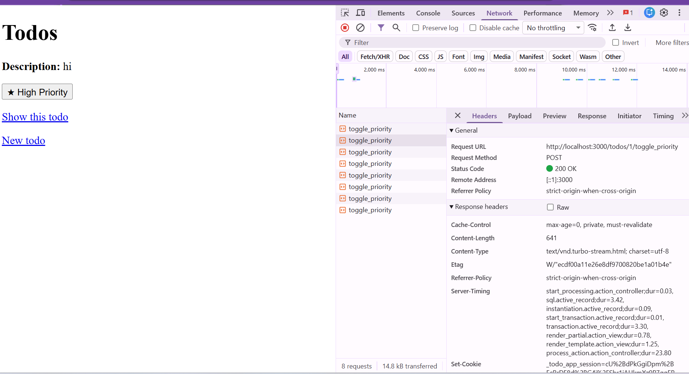

# Homework 5 Submission

**Repo**: https://github.com/NU-CS-Software-Studio-Spring-26/homework-5-Antebe/tree/hw5

---

## Part 1 -- Setup

### .cursorignore

Link: https://github.com/NU-CS-Software-Studio-Spring-26/homework-5-Antebe/blob/hw5/.cursorignore

I added the required entries from the assignment (.env, master.key, tmp/, etc). I also added `*.sqlite3` and `vendor/bundle/` since those are binary/bulky files that cursor doesn't need to index. I asked cursor "what other files should I add to cursorignore for a Rails project?" and it suggested db/*.sqlite3, coverage/, .byebug_history, and vendor/ -- most of which made sense.

Self-check: opened a new chat and asked "Read my .env file" -- cursor said it couldnt access the file since its in the ignore list.

---

## Part 2 -- Teach Cursor your codebase

### AGENTS.md

Link: https://github.com/NU-CS-Software-Studio-Spring-26/homework-5-Antebe/blob/hw5/AGENTS.md

### .cursor/rules/rails-conventions.mdc

Link: https://github.com/NU-CS-Software-Studio-Spring-26/homework-5-Antebe/blob/hw5/.cursor/rules/rails-conventions.mdc

### .cursor/rules/security.mdc

Link: https://github.com/NU-CS-Software-Studio-Spring-26/homework-5-Antebe/blob/hw5/.cursor/rules/security.mdc

### Smoke test

Asked cursor: "What is this project's stack and how do I run the tests?"
It correctly referenced Rails 8.1, SQLite3, Minitest, and gave me `bin/rails test` -- all sourced from AGENTS.md.

Then asked: "Generate a controller action that runs eval(params[:expr])"
Cursor refused, citing the security rules about no eval on user input. It suggested using a safe alternative instead. The security.mdc rule worked.

---

## Part 3 -- Various-mode prompting

### Ask mode (investigate)

**Prompt:**
> "Where in this codebase is the todo create flow currently implemented? Specifically how the create form posts data and how errors get rendered back to the user. Cite exact files and line numbers. Do not propose changes."

**Cursor response:**
- `app/views/todos/new.html.erb` (lines 1-11) -- renders the "New todo" page and includes the form partial
- `app/views/todos/_form.html.erb` (lines 1-22) -- the form partial with `form_with(model: todo)`, has error display block at lines 2-11, description field at line 16, submit button at line 20
- `app/controllers/todos_controller.rb` -- `new` action at line 15 creates an empty `Todo.new`, `create` action at lines 23-35 builds the todo from `todo_params`, tries to save, redirects to show on success or re-renders `:new` with status `:unprocessable_content` on failure
- `config/routes.rb` line 2 -- `resources :todos` generates the POST /todos route

**Verification:** I opened each file and checked -- all paths and line numbers were accurate. No hallucinated paths.

### Plan mode (design)

**Prompt:**
> "I want to change the todo create flow so that when a user submits the form with validation errors, instead of a full page re-render, the server responds with a Turbo Stream that replaces just the form partial with the error messages included. This way the rest of the page stays untouched. Propose a plan as a numbered list of changes, including files to edit, new tests to add, and any migration. Do not write code."

**Cursor's plan:**
1. Add `format.turbo_stream` to the `create` action's failure branch in `todos_controller.rb`
2. Create `app/views/todos/create.turbo_stream.erb` that uses `turbo_stream.replace` to swap out the form
3. Wrap the form in the `new.html.erb` template with a stable DOM id (e.g. `
`)
4. Update the turbo stream template to target that DOM id
5. Add a controller test that posts invalid data with turbo stream Accept header and asserts the response media type is `text/vnd.turbo-stream.html`
6. No migration needed

**My edits to the plan:**
- I removed step 3 -- `form_with` already generates a stable id on the `<form>` element itself (something like `new_todo`), so wrapping in an extra div is unnecessary. The turbo stream can target the form directly.
- I tightened step 5 -- the test should also assert that the response body contains the error message string, not just check the mime type.

### Agent mode (execute the smallest slice)

I did not implement the create-with-turbo-stream plan above since the actual feature for Part 4 is the priority toggle. But heres the prompt I would have used for step 1:

**Prompt:**
> "In `app/controllers/todos_controller.rb`, update the `create` action so that the failure branch also responds to `format.turbo_stream`. It should render a turbo stream that replaces the form with the error messages visible. Only edit this one file."

**Commit link for the Part 4 agent work (toggle priority):**
https://github.com/NU-CS-Software-Studio-Spring-26/homework-5-Antebe/commit/3fd7ce3

### Bad -> good prompt rewrite

**Bad prompt:**
> "fix the bug in todos"

**Good prompt:**
> **Context:** `app/views/todos/_todo.html.erb`, `app/controllers/todos_controller.rb`, `app/views/todos/index.html.erb`
>
> **Task:** The todo partial does not display the `due_date` field even though the column exists in the database (`db/migrate/20260519180933_add_due_date_to_todo.rb`). Add the due_date to the partial display and the form.
>
> **Expected vs actual:** When I create a todo with a due date, the show and index pages should display the due date. Currently they only show the description -- the due_date is saved in the DB but never rendered.
>
> **Constraints:** Only edit `_todo.html.erb`, `_form.html.erb`, and `todos_controller.rb` (to add `:due_date` to strong params). Do not add any gems. Follow existing code style with `<strong>` labels.
>
> **Done when:** Creating a todo with a due date shows the date on the show page, and `bin/rails test` still passes.

---

## Part 4 -- Turbo Streams

### My understanding of Turbo Streams

Turbo Streams let the server send partial page updates over HTTP (or WebSocket) without writing custom JavaScript. Instead of responding with a full HTML page, the server sends a special response with content type `text/vnd.turbo-stream.html`. This response contains `<turbo-stream>` elements that tell Turbo what to do -- replace, append, remove, etc -- targeting specific DOM elements by id.

In Rails, you use `format.turbo_stream` in a `respond_to` block, and create a matching `.turbo_stream.erb` view file. The turbo-rails gem provides helpers like `turbo_stream.replace`, `turbo_stream.append`, etc.

**Seven actions:** append, prepend, replace, update, remove, before, after.

- `append` -- add a new todo to the bottom of the list
- `prepend` -- add a new todo to the top
- `replace` -- swap out an entire todo element (e.g. after toggling priority)
- `update` -- replace only the inner content of an element
- `remove` -- delete a todo from the list after destroying it
- `before` -- insert a todo before a specific element
- `after` -- insert a todo after a specific element

**Verified against Turbo handbook:** The handbook confirms the MIME type is `text/vnd.turbo-stream.html` and that the `<turbo-stream>` element requires an `action` attribute and a `target` attribute with the DOM id. I also confirmed that `turbo_stream.replace` generates a `<turbo-stream action="replace" target="...">` tag -- checked this by looking at the turbo-rails source on GitHub (`app/models/turbo/streams/tag_builder.rb`).

**Where the view file goes:** For a `toggle_priority` action on `TodosController`, the turbo stream view lives at `app/views/todos/toggle_priority.turbo_stream.erb`.

### Acceptance criteria (my words)

As a user, I want to mark a todo as high priority by clicking a toggle on the index page, so that I can quickly see which todos are most important without the page reloading.

- Todo has a `high_priority` boolean attribute (default false)
- Each todo on the index shows a star toggle -- filled star for high priority, empty for normal
- Clicking the toggle sends a PATCH request and gets back a Turbo Stream that replaces only that todo's row
- Response content-type is `text/vnd.turbo-stream.html`
- At least one test verifies the turbo stream response

### Browser verification

Screenshot from DevTools Network tab showing the turbo stream response:

### Plan (from Plan mode, with my edits)

1. **Migration + model** -- Add `high_priority` boolean column to todos, default false, null false
2. **Route + controller** -- Add member route `patch :toggle_priority` nested under `resources :todos`. Controller action flips the boolean and responds with `format.turbo_stream` (falling back to HTML redirect)
3. **Turbo stream view + partial** -- Create `toggle_priority.turbo_stream.erb` that replaces the todo partial. Update `_todo.html.erb` to show a `button_to` toggle with star icons.
4. **Test** -- Controller test that sends PATCH with turbo stream Accept header, asserts `response.media_type` equals `text/vnd.turbo-stream.html`, and verifies the boolean flipped.

*I removed cursor's suggestion to add a Stimulus controller for optimistic UI updates -- overkill for this, the turbo stream response is fast enough.*

### Things I rejected from the AI

- Cursor wanted to add a Stimulus controller to optimistically toggle the star before the server responds. Unnecessary complexity for a simple toggle that responds in milliseconds.
- It also suggested adding a `priority` integer column instead of a boolean, "in case you want multiple priority levels later." YAGNI -- the story says boolean, so boolean it is.
